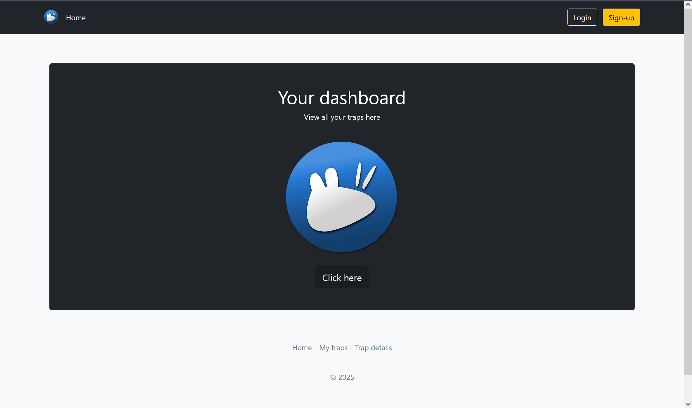

# IOT-DC-LTE_project

## Project Setup Guide

This guide will walk you through the steps to set up the IOT-DC-LTE project, including flashing the Pycom FiPy, configuring the code, and running the Flask webserver.

### Prerequisites

- Software:
   - Visual Studio Code (VSCode)
   - PyMakr Extension for VSCode
   - Python 3.x
   - Flask
- Hardware:
   - Pycom FiPy
   - Pycom Expansion Board (Or some way to power and send data to the FiPy)
   - NB-IOT capable SIM Card (for testing WiFi is available)
   - Antenna optimized for LTE (u.fl connector)
- Basic knowledge of GitHub and VS Code is expected and reading documentation of software (extentions) used, as that is best for understanding the full workings of the software.

### Step 1: Downloading the Code

1. **Clone the Repository:**
   - Open a terminal in the folder you want to download the code into and run the following command to clone the repository:
     ```sh
     git clone https://github.com/KickingAnimal/IOT-DC-LTE_project.git
     ```

2. **Open the Project in VSCode:**
   - Open VSCode.
   - Go to `File` > `Open Folder` and select the cloned repository folder.

### Step 2: Configuring the Code

1. **Update WiFi and Server Configuration:**
   - Open the `pycom/config.py` file.
   - Update the `serverURL`, `port`, `connectURL`, and `statusURL` variables with your server details.
   - Update the `apnName` in `pycom/config.py` with your APN.

   ```python
   # filepath: IOT-DC-LTE_project/pycom/config.py
   # ...existing code...
   apnName = "your_apn"  # Replace 'your_apn' with your APN needed for your SIM card
   # ...existing code...
   serverURL = 'your.server.ip'
   port = 4000
   ```

2. **Update WiFi Credentials:**
   - This is only needed if you're not using a SIM and are testing initial setup
   - Open the `pycom/wificonfig.py` file.
   - Update the `SSID` and `PASSWORD` variables with your WiFi credentials.

   ```python
   # filepath: IOT-DC-LTE_project/pycom/wificonfig.py
   SSID = 'your_wifi_ssid'
   PASSWORD = 'your_wifi_password'
   ```

### Step 3: Flashing the Pycom FiPy

1. **Install Pymakr Extension in VSCode:**
   - Open VSCode.
   - Go to the Extensions view by clicking the Extensions icon in the Activity Bar on the side of the window.
   - Search for "PyMakr" and install the PyMakr extension.

2. **Connect Pycom FiPy to Expansion Board:**
   - Connect your Pycom FiPy to the Pycom Expansion Board.
   - Connect the Expansion Board to your computer via USB.

3. **Flash the Firmware:**
   - Open the PyMakr tab in VSCode.
   - Select the correct serial port for your FiPy.
   - Click on the "Sync project to device" button to flash the latest firmware to your FiPy.
   
   

### Step 4: Wiring setup for the FiPy
1. **Default Wiring Diagram**
   
   - The antenna needs to be connected to the underside of the board
   - The power input can be a range of voltages, most commonly 5v.
 
### Step 5: Running the Flask Webserver

1. **Install Dependencies:**
   - Navigate to the `flask-iot-webserver` directory.
   - Run the following command to install the required dependencies:
     ```sh
     pip install -r requirements.txt
     ```

2. **Run the Webserver:**
   - Run the following command to start the Flask webserver:
     ```sh
     python server.py
     ```

3. **Access the Webserver:**
   - Open a web browser and go to `http://your.server.ip:4000` for HTTP (depending on your server settings)
   
   

### Additional Information

- **LED Indications:**
  - The FiPy will cycle through RGB colors on startup after it has connected to NB-IOT or the back-up WiFi connection.
  - During the boot proecess the LED will blink Blue occasionaly
  - It will blink green on successful data transmission and red on failure.
  - When connected the LED will blink yellow ~every 30 seconds to indicate that it is still powered on.
  - The LED will blink blue every time it has sent a 'heartbeat' signal to the server with success. 

- **Button Press:**
  - Pressing the button connected to `P11` will attempt to connect to the server.
  - This is a pairing mode, after having pressed the button you can register the device to an account.
  - If the connection is succesfull and the server does not give an error the LED will blink green. if the LED blinks red there was an error. (Device is already registered or another error, this can be seen on the serial port of the FiPy)

For more details, refer to the code comments and documentation within the project files.
